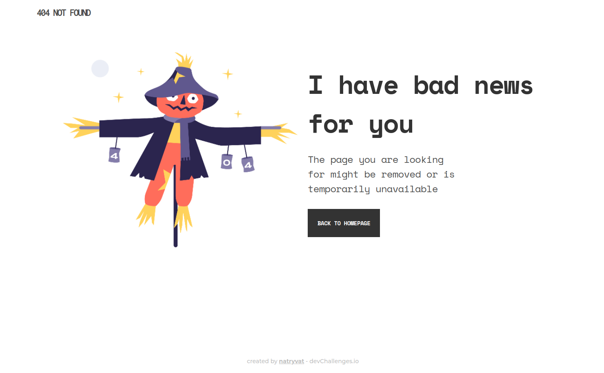
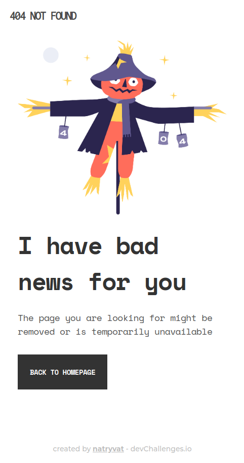

<h1 align="center">404 Not Found</h1>

   Solution for a challenge from  <a href="http://devchallenges.io" target="_blank">Devchallenges.io</a>.

  <h3>
    <a href="http://404-not-found.projects.natryvat.com">
      Demo
    </a>
     | 
    <a href="https://github.com/angeling11/devchallenges-404-not-found">
      Solution
    </a>
     | 
    <a href="https://devchallenges.io/challenges/wBunSb7FPrIepJZAg0sY">
      Challenge
    </a>
  </h3>

<!-- TABLE OF CONTENTS -->

## Table of Contents

- [Overview](#overview)
  - [Built With](#built-with)
- [Features](#features)
- [Contact](#contact)
- [Acknowledgements](#acknowledgements)

<!-- OVERVIEW -->

## Overview

### Desktop version

### Mobile version

Introduce your projects by taking a screenshot or a gif. Try to tell visitors a story about your project by answering:

- Where can I see your demo?

- What was your experience?
This was a refresh to CSS as I haven't used it in a while. Hoever, kniwd the basic is very helpful as well as having the design is a great advantage.
- What have you learned/improved?
At the beggining I didn't know how to start. I wanted to do it without any library but I got a useful solution but there ware sone gaps in the resposivity. Then I decided to use Bulma CSS just to try it as I had just used bootrap before.
- Your wisdom? :)
Always try the best and put attention to details.

### Built With

- [Bulma](https://bulma.io/)

## Features

This application/site was created as a submission to a [DevChallenges](https://devchallenges.io/challenges) challenge. The [challenge](https://devchallenges.io/challenges/wBunSb7FPrIepJZAg0sY) was to build a responsive 404 not found page.

## Acknowledgements

- [Bulma - CSS framework](https://bulma.io/documentation/)
- [Surge](https://surge.sh/)

## Contact

- Website [whoami.natryvat.com](https://whoami.natryvat.com/)
- GitHub [@angeling11](https://github.com/angeling11)
- Twitter [@angeling_11](https://twitter.com/angeling_11)
